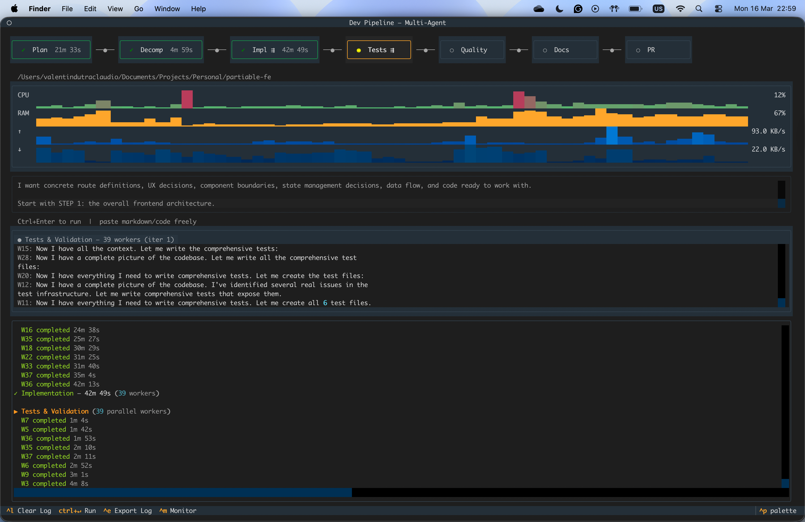

# Step-by-Step

A terminal UI that runs your development tasks through a structured multi-agent pipeline. You describe what you want to build; a team of specialized Claude agents plans, implements, tests, reviews, and opens a pull request — autonomously.



---

## How it works

Step-by-Step models software delivery as a linear pipeline of specialized agents, each owning a single responsibility. Stages that can be parallelized fan out into independent worker agents that run concurrently, then merge their results before the next stage begins.

```
Plan ──● Decomp ──● Impl ⇶ ──● Tests ⇶ ──● Quality ──● Docs ──● PR
```

`⇶` = parallel workers · `●` = single agent

### Pipeline stages

| Stage | Mode | What it does |
|---|---|---|
| **Planning** | Single agent | Senior architect reads your codebase and produces a concrete, numbered implementation plan |
| **Decomposition** | Manager agent | Splits the plan into independent subtasks that can be worked on simultaneously |
| **Implementation** | Parallel workers | Each subtask is handed to a dedicated worker agent; all workers run concurrently |
| **Tests & Validation** | Parallel workers | QA agents write and run tests per subtask; surface failures via `## Issues Found` |
| **Code Quality** | Single agent | Reviewer checks for code smells, security issues, and readability |
| **Documentation** | Single agent | Generates or updates README sections, docstrings, and API reference |
| **Commit & PR** | Single agent | Writes conventional commits and opens a GitHub Pull Request |

### Refinement loops

Claude drives two autonomous feedback loops — it decides when to stop by reporting `## Issues Found: None`.

- **Test loop** — cycles through Implementation → Tests & Validation until no issues remain
- **Quality loop** — re-decomposes and re-implements until Code Quality is satisfied

### RAM-based flow control

Worker concurrency is not capped by a fixed number. Instead, the pipeline uses TCP-style flow control: a new worker starts only when system RAM is below 75%. Starts are serialized and include a post-start delay so the OS can register each new process's footprint before the next candidate is evaluated. When RAM is high, new workers queue up and resume as running workers release memory.

---

## Requirements

- **Python 3.13+**
- **[uv](https://docs.astral.sh/uv/)** (recommended) or pip
- **[Claude Code CLI](https://docs.anthropic.com/en/docs/claude-code)** — `npm install -g @anthropic-ai/claude-code`
- **[GitHub CLI](https://cli.github.com/)** — required for the Commit & PR stage (`gh auth login`)
- **[Codex CLI](https://developers.openai.com/codex)** *(optional)* — `npm install -g @openai/codex`; only needed if a phase uses `provider = "codex"`
- **[Gemini CLI](https://github.com/google-gemini/gemini-cli)** *(optional)* — `npm install -g @google/gemini-cli`; only needed if a phase uses `provider = "gemini"`

---

## Installation

**Via npm (recommended):**
```bash
npm install -g step-by-step-cli
```

**Via uv:**
```bash
uvx --from step-by-step-cli pipeline
```

**Via pip:**
```bash
pip install step-by-step-cli
pipeline
```

**From source:**
```bash
git clone https://github.com/ValentinDutra/step-by-step-cli.git
cd step-by-step-cli
uv sync
```

---

## Configuration

By default every stage runs on Claude. To run specific phases on a different CLI, create a `step-by-step.toml`. Resolution order (first found wins): `--config PATH`, then `step-by-step.toml` in the target repo, then `~/.config/step-by-step/config.toml`. With no config, behavior is unchanged (all Claude).

```toml
[defaults]
provider = "claude"        # claude | codex | gemini
model = ""                 # empty = the CLI's default model

[phases."Code Quality"]
provider = "codex"
model = "gpt-5.1-codex"

[phases.Planning]
provider = "gemini"
model = "gemini-3.5-flash"
```

Phase names match the pipeline stages: `Planning`, `Decomposition`, `Implementation`, `Tests & Validation`, `Code Quality`, `Documentation`, `Commit & PR`. Any phase you do not list falls back to `[defaults]`. Models are passed through to the CLI as-is. An unknown provider aborts before the run with a clear message, and a missing provider CLI is reported before stage 1.

Each provider handles its own authentication: `claude` (Claude Code login), `codex` (`codex login` or `OPENAI_API_KEY`), `gemini` (`gemini` login or `GEMINI_API_KEY`).

### Customizing the pipeline

By default the seven phases run in their listed order. Set a `pipeline` array to reorder phases, drop built-ins (e.g. omit `"Tests & Validation"`), or add your own prompt-only phases. With no `pipeline` key, the default seven run unchanged.

```toml
pipeline = ["Research", "Planning", "Decomposition", "Implementation", "Tests & Validation", "Commit & PR"]

[phases."Research"]          # a custom phase
kind = "simple"
skill = "research"           # -> .step-by-step/skills/research/SKILL.md

[phases."Code Quality"]
max_iterations = 3           # cap the quality gate's re-run loop (default 3)
```

Each phase has a `kind`:

| `kind` | behavior | built-ins |
|---|---|---|
| `simple` | one prompt -> one output | Planning, Documentation |
| `decompose` | splits the plan into parallel subtasks | Decomposition |
| `parallel` | fans out one worker per subtask | Implementation, Tests & Validation |
| `gate` | reviews, then loops back to re-run (capped by `max_iterations`, default 3) | Code Quality |
| `commit_pr` | creates the branch and the PR | Commit & PR |

Custom phases must be `kind = "simple"` — the other kinds are reserved for the built-ins. A `simple` phase declares its prompt with either `skill = "name"` (a folder containing `SKILL.md`, resolved from `<repo>/.step-by-step/skills/` then `~/.config/step-by-step/skills/`) or an inline `prompt = "..."` — exactly one. A built-in phase may override its prompt the same way.

The pipeline is validated before the run: an empty pipeline, duplicate names, a `parallel` phase with no preceding `decompose`, more than one `commit_pr` or `gate`, a custom phase that isn't `simple`, or one missing both `skill` and `prompt` all abort with a clear message. A `[phases.X]` table for a phase that isn't in the pipeline is ignored.

### Safety

The pipeline runs every provider fully autonomous — no sandbox, no approval prompts (`--dangerously-skip-permissions` for Claude, `--dangerously-bypass-approvals-and-sandbox` for Codex, `--yolo` for Gemini). With a multi-provider config that is up to three agents with full read/write/execute access to the target repository. Run it on a throwaway branch or an isolated clone.

---

## Usage

**npm / pip install:**
```bash
# Run against the current directory
pipeline

# Run against a specific repository
pipeline /path/to/your/repo

# Load a prompt from a file and start immediately
pipeline /path/to/your/repo -f prompt.txt
```

**uvx (no install):**
```bash
uvx --from step-by-step-cli pipeline
uvx --from step-by-step-cli pipeline /path/to/your/repo
```

**From source:**
```bash
uv run pipeline
uv run pipeline /path/to/your/repo
uv run pipeline /path/to/your/repo -f prompt.txt
```

Type your task in the input area at the bottom and press `Ctrl+Enter` to start.

### Keyboard shortcuts

| Key | Action |
|---|---|
| `Ctrl+Enter` | Submit prompt and run the pipeline |
| `Ctrl+L` | Clear the activity log |
| `Ctrl+E` | Export log to `pipeline_log_<timestamp>.txt` |
| `Ctrl+C` | Quit |

### Re-running from a specific stage

Once a run completes, every stage pill in the header becomes clickable. Click any stage to **re-run from that point forward**, reusing all prior context — useful for retrying a failed stage or iterating on implementation without re-planning.

---

## UI layout

```
┌─────────────────────────────────────────────────────────────────┐
│  Plan  │  Decomp  │  Impl ⇶  │  Tests ⇶  │  Quality  │  PR    │  ← stage bar
├─────────────────────────────────────────────────────────────────┤
│  > Describe your task…                                          │  ← prompt input
├──────────────────────────────┬──────────────────────────────────┤
│  ● Planning                  │                                  │
│                              │         Activity log             │
│      Streaming pane          │   (full chronological history)   │
│  (live output from active    │                                  │
│   stage or worker)           │                                  │
├──────────────────────────────┴──────────────────────────────────┤
│  ^p palette  ^l Clear Log  ctrl+↵ Run  ^e Export Log  ^m Monitor        Calls: 4  |  Cost: $0.0234  |  Time: 1m 20s  │
└─────────────────────────────────────────────────────────────────┘
```

---

## Project structure

```
app/
├── __main__.py      Entry point
├── models.py        Shared data classes (Task, WorkerResult, PipelineStats)
├── agents.py        Claude CLI invocation, flow control, and worker coordination
├── stages.py        Stage definitions, prompt templates, and pipeline configuration
├── pipeline.py      Stage runners: run_stage() and run_stage_parallel()
├── runner.py        PipelineRunnerMixin: run_pipeline() and rerun_from_stage()
├── widgets.py       StagePill TUI widget and display constants
├── git.py           Git/gh subprocess helpers and Commit & PR stage runner
└── tui.py           PipelineApp (Textual App) and main() entry point
```

---

## Safety

The pipeline invokes `claude --dangerously-skip-permissions` so agents can read and write files autonomously. **Only point it at repositories where you trust the output.** Always review the diff before the PR stage commits.

Each subprocess is run with a 10-minute timeout and cleaned up unconditionally on exit — even on errors or cancellation — so stalled Claude processes do not accumulate.

---

## License

MIT © Valentin Dutra — see [LICENSE](LICENSE)
